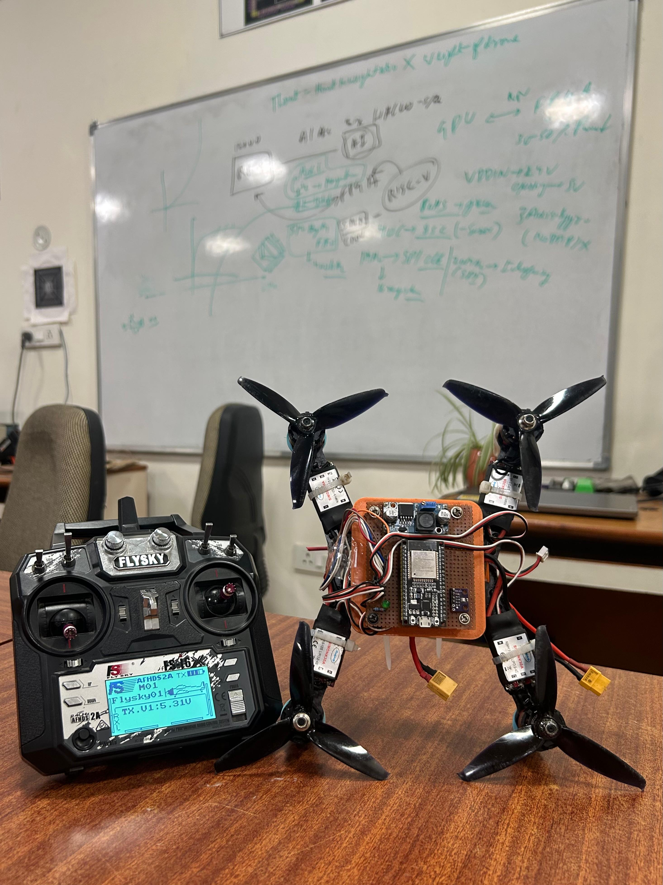

# ESP32 Quadcopter Flight Controller

<p align="center">
  
</p>

<p align="center">
  <b>ESP32-based quadcopter flight controller with IMU sensing, PID stabilization, FlySky radio control, and four-motor ESC control.</b>
</p>

---

## Overview

This project is an **ESP32-based quadcopter flight controller** designed around real-time attitude stabilization and motor control.

The ESP32 acts as the central controller, receiving pilot commands from a **FlySky FS-i6X transmitter/receiver**, reading motion data from an **MPU6050 IMU**, estimating roll and pitch using a **complementary filter**, and applying cascaded **angle and rate PID control** to stabilize the quadcopter.

A **BMP280 barometric sensor** is included in the hardware architecture for height/altitude measurement and future altitude-control functionality.

The power system uses an **XT60 connector**, a **power distribution board (PDB)** for the ESC power architecture, and a **buck converter providing a regulated 3.3 V supply for the ESP32**.

---

## Key Features

- ESP32-based custom flight controller
- MPU6050 6-axis IMU
  - 3-axis accelerometer
  - 3-axis gyroscope
- BMP280 barometric sensor for height/altitude measurement
- FlySky FS-i6X transmitter and receiver
- 6-channel PWM receiver input
- Complementary-filter-based roll/pitch estimation
- Cascaded angle + rate PID control
- Dedicated yaw-rate PID control
- Four independent ESC outputs
- 500 Hz ESC control frequency
- 1000–2000 µs ESC pulse range
- Throttle limiting and motor cutoff
- LED-based startup/calibration indication
- XT60 main battery connection
- Power distribution board for the ESC power system
- Buck-converter-based regulated 3.3 V supply for ESP32

---

## System Architecture

```text
                       ┌──────────────────────┐
                       │    FlySky FS-i6X     │
                       │      Transmitter     │
                       └──────────┬───────────┘
                                  │
                              Wireless
                                  │
                                  ▼
                       ┌──────────────────────┐
                       │   FlySky Receiver    │
                       │      CH1 – CH6       │
                       └──────────┬───────────┘
                                  │ PWM
                                  ▼
                    ┌────────────────────────────┐
                    │            ESP32            │
                    │      Flight Controller      │
                    ├────────────────────────────┤
                    │ Receiver Input Processing  │
                    │ Sensor Processing          │
                    │ Attitude Estimation        │
                    │ Angle PID                  │
                    │ Rate PID                   │
                    │ Motor Mixing               │
                    └───────┬─────────┬──────────┘
                            │         │
                       I²C  │         │ PWM
                            │         │
              ┌─────────────┘         └──────────────┐
              ▼                                      ▼
       ┌─────────────┐                    ┌────────────────┐
       │   MPU6050   │                    │   ESC 1 – 4    │
       │ Acc + Gyro  │                    └───────┬────────┘
       └─────────────┘                            │
              ▲                                   ▼
              │                            4 × BLDC Motors
              │
       ┌─────────────┐
       │   BMP280    │
       │  Barometer  │
       └─────────────┘
```

---

## Control Flow

The controller operates as a closed-loop stabilization system:

```text
Pilot Command
     │
     ▼
FlySky Receiver
     │
     ▼
ESP32
     │
     ├──────────────► MPU6050
     │                   │
     │                   ├── Accelerometer
     │                   └── Gyroscope
     │
     ▼
Attitude Estimation
     │
     ▼
Complementary Filter
     │
     ▼
Angle PID
     │
     ▼
Desired Angular Rate
     │
     ▼
Rate PID
     │
     ▼
Motor Mixer
     │
     ├──────► ESC 1 ───► Motor 1
     ├──────► ESC 2 ───► Motor 2
     ├──────► ESC 3 ───► Motor 3
     └──────► ESC 4 ───► Motor 4
```

---

## Hardware

| Component | Purpose |
|---|---|
| **ESP32** | Main flight controller |
| **MPU6050** | Accelerometer and gyroscope |
| **BMP280** | Barometric height/altitude measurement |
| **FlySky FS-i6X + Receiver** | Pilot command and 6-channel PWM input |
| **4 × ESCs** | Independent motor speed control |
| **4 × BLDC Motors** | Thrust generation |
| **Power Distribution Board** | Battery power distribution for ESCs |
| **XT60 Connector** | Main LiPo battery connection |
| **Buck Converter** | Regulated 3.3 V supply for ESP32 |
| **LED** | Startup/calibration indication |
| **LiPo Battery** | Main power source |

Detailed hardware information is available in [`hardware/`](hardware/).

---

## Power Architecture

```text
             LiPo Battery
                  │
                  ▼
               XT60 Plug
                  │
                  ▼
        Power Distribution Board
          │       │       │       │
          ▼       ▼       ▼       ▼
        ESC 1   ESC 2   ESC 3   ESC 4
          │       │       │       │
         M1      M2      M3      M4

                  │
                  ▼
           Buck Converter
                  │
                  ▼
              Stable 3.3 V
                  │
                  ▼
                ESP32
```

The **XT60** provides the main battery connection.

The **PDB** distributes the battery power to the four ESCs and provides the regulated 5 V rail used by the ESC-side electronics according to the implemented power architecture.

The **buck converter** steps the available supply down to a stable **3.3 V rail for the ESP32**.

> Always verify the buck-converter output with a multimeter before connecting it to the ESP32.

---

## Sensors

### MPU6050

The MPU6050 is the primary inertial measurement unit.

It provides:

- Accelerometer X/Y/Z
- Gyroscope X/Y/Z

The firmware uses the sensor data for:

- Roll estimation
- Pitch estimation
- Angular-rate feedback
- Attitude stabilization

The MPU6050 communicates with the ESP32 through I²C at address `0x68`.

### BMP280

The BMP280 is included for:

- Barometric pressure measurement
- Relative altitude estimation
- Height monitoring

The current supplied firmware does **not yet implement BMP280 initialization or altitude processing**. The sensor is therefore part of the hardware architecture and is ready for future altitude-control functionality.

---

## Radio Control

The **FlySky FS-i6X** provides pilot commands through its receiver.

| Channel | ESP32 GPIO | Function |
|---|---:|---|
| CH1 | GPIO 25 | Roll |
| CH2 | GPIO 33 | Pitch |
| CH3 | GPIO 32 | Throttle |
| CH4 | GPIO 35 | Yaw |
| CH5 | GPIO 34 | Auxiliary |
| CH6 | GPIO 13 | Auxiliary |

The receiver signals are measured using GPIO interrupts.

---

## Motor / ESC Mapping

| Motor / ESC | ESP32 GPIO | Position |
|---|---:|---|
| Motor 1 / ESC 1 | GPIO 27 | Front-right |
| Motor 2 / ESC 2 | GPIO 14 | Rear-right |
| Motor 3 / ESC 3 | GPIO 12 | Rear-left |
| Motor 4 / ESC 4 | GPIO 26 | Front-left |

The current firmware uses:

```text
ESC Frequency : 500 Hz
PWM Range     : 1000–2000 µs
Throttle Idle : 1170 µs
Motor Cutoff  : 1000 µs
```

Motor rotation direction and propeller orientation must be verified on the physical aircraft before flight.

---

## PID Control

The controller uses a cascaded PID structure for roll and pitch:

```text
Desired Angle
      │
      ▼
   Angle PID
      │
      ▼
Desired Rate
      │
      ▼
    Rate PID
      │
      ▼
Motor Correction
```

Yaw is controlled through a dedicated rate PID.

### Current PID Parameters

| Controller | P | I | D |
|---|---:|---:|---:|
| Roll Angle | 2 | 0.5 | 0.007 |
| Pitch Angle | 2 | 0.5 | 0.007 |
| Roll Rate | 0.625 | 2.1 | 0.0088 |
| Pitch Rate | 0.625 | 2.1 | 0.0088 |
| Yaw Rate | 4 | 3 | 0 |

These are the tuning values currently present in the firmware and are specific to the present hardware configuration.

---

## Attitude Estimation

The firmware calculates roll and pitch from the accelerometer and combines them with gyroscope integration using a complementary filter.

```text
Gyroscope
    │
    ▼
Fast attitude response
    │
    ├──────────┐
    │          │
    │     Complementary
    │        Filter
    │          │
    │          ▲
    │          │
    └──────────┤
               │
        Accelerometer
        long-term reference
```

The current filter uses:

```text
0.991 × gyro estimate
+
0.009 × accelerometer estimate
```

with a nominal control-loop interval of:

```text
dt = 0.004 s
```

The filtered roll and pitch angles are limited to ±20° in the supplied firmware.

---

## Control Loop

The nominal control-loop period is:

```text
0.004 seconds
```

which corresponds to:

```text
250 Hz
```

Each cycle performs the following operations:

```text
1. Read MPU6050
2. Apply sensor calibration
3. Calculate accelerometer angles
4. Update complementary filter
5. Read receiver commands
6. Calculate desired angles/rates
7. Run angle PID
8. Run rate PID
9. Calculate motor mixing
10. Apply output limits
11. Apply throttle cutoff when required
12. Write ESC PWM outputs
13. Maintain loop timing
```

---

## Safety / Motor Cutoff

The firmware contains a low-throttle cutoff condition.

When:

```text
Throttle < 1030 µs
```

the four motor outputs are forced to:

```text
1000 µs
```

The relevant PID error and integral states are also reset.

### Bench Testing

Before testing the flight controller:

- Remove all propellers.
- Verify battery polarity.
- Verify the XT60 connection.
- Verify the buck-converter output is **3.3 V**.
- Verify receiver channel mapping.
- Verify ESC signal mapping.
- Verify motor numbering.
- Verify motor rotation direction.
- Verify throttle cutoff.
- Verify sensor readings while the frame is stationary.

> **Never perform initial motor-control testing with propellers installed.**

---

## Calibration

The current firmware uses the following sensor calibration values:

```text
RateCalibrationRoll  = -2.43
RateCalibrationPitch = -0.48
RateCalibrationYaw   = -0.83

AccXCalibration = -0.03
AccYCalibration = -0.04
AccZCalibration =  0.14
```

These values are specific to the current sensor/setup and should be recalculated if the IMU is replaced, remounted, or significantly reconfigured.

GPIO 15 is used for LED startup/calibration indication.

For the complete procedure, see [`documentation/calibration.md`](documentation/calibration.md).

---

## Firmware

The flight-controller firmware is located at:

```text
firmware/
└── ESP32_Quadcopter/
    └── ESP32_Quadcopter.ino
```

The firmware is written for the **Arduino framework on ESP32** and uses:

- `Wire.h`
- `ESP32Servo.h`

### Main Firmware Responsibilities

```text
Receiver Input
      ↓
Sensor Acquisition
      ↓
Calibration
      ↓
Attitude Estimation
      ↓
PID Control
      ↓
Motor Mixing
      ↓
ESC PWM Generation
```

---

## Repository Structure

```text
ESP32-Quadcopter-Flight-Controller/
│
├── README.md
│
├── firmware/
│   └── ESP32_Quadcopter/
│       └── ESP32_Quadcopter.ino
│
├── hardware/
│   ├── components.md
│   ├── pinout.md
│   └── wiring.md
│
├── documentation/
│   ├── flight_controller.md
│   ├── control_system.md
│   ├── pid_control.md
│   └── calibration.md
│
└── images/
    └── quadcopter.jpeg
```

---

## Documentation

| Document | Description |
|---|---|
| [`hardware/components.md`](hardware/components.md) | Complete hardware/component list |
| [`hardware/pinout.md`](hardware/pinout.md) | ESP32 GPIO assignments |
| [`hardware/wiring.md`](hardware/wiring.md) | Complete electrical wiring and power architecture |
| [`documentation/flight_controller.md`](documentation/flight_controller.md) | Flight-controller operation |
| [`documentation/control_system.md`](documentation/control_system.md) | Complete control-system architecture |
| [`documentation/pid_control.md`](documentation/pid_control.md) | PID implementation and tuning |
| [`documentation/calibration.md`](documentation/calibration.md) | Sensor calibration and startup sequence |

---

## Current Implementation Status

| Feature | Status |
|---|---|
| ESP32 flight controller | ✅ Implemented |
| MPU6050 accelerometer | ✅ Implemented |
| MPU6050 gyroscope | ✅ Implemented |
| Receiver PWM input | ✅ Implemented |
| Complementary attitude filter | ✅ Implemented |
| Roll/Pitch angle PID | ✅ Implemented |
| Roll/Pitch rate PID | ✅ Implemented |
| Yaw rate PID | ✅ Implemented |
| 4-channel ESC control | ✅ Implemented |
| Motor mixing | ✅ Implemented |
| Throttle cutoff | ✅ Implemented |
| LED startup indication | ✅ Implemented |
| BMP280 hardware | ✅ Included |
| BMP280 firmware integration | ⏳ Future |
| Altitude-hold control | ⏳ Future |

---

## Future Improvements

- BMP280 firmware integration
- Barometric altitude estimation
- Altitude-hold controller
- Automated sensor calibration
- Improved arming/disarming state machine
- Battery voltage monitoring
- Low-battery warning
- More advanced failsafe handling
- Flight-data logging
- Wireless telemetry
- PID tuning interface

---

## Disclaimer

This project controls a flying vehicle using high-speed rotating motors and propellers. Improper wiring, incorrect PID tuning, incorrect motor direction, or software/hardware faults can cause serious damage or injury.

Test progressively and safely, beginning with **propellers removed** and verifying every subsystem before attempting flight.
